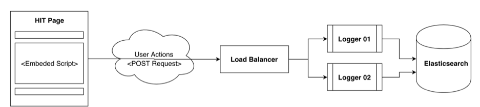

# UQCrowd Logging System

**More Documents:**

1. Installation & Operation Guide: [README-MANUAL.md](README-MANUAL.md)
1. Log Message Format: [README-FORMAT.md](README-FORMAT.md)

## System Overall

The UQCrowd-Logging system uses HAProxy as a reverse proxy to distribute the incoming requests to multiple backends,
the optimized number of backends depends on the server's configuration, 8 is the optimized number for a server
with 40 Core, 60GB of RAM (derived from our performance test). The maximum throughput with the current configuration
 is ~2300 request/s (which can be doubled by adopting a message queue such as Redis)

**Figure 1.** Overall system diagram

_Note: The SSL certificates is handled by the UQ's Front Proxy._

## How To Use

This document is to describe how to inject javascript to record user actions on a MTurk Hit,

In order to inject the default logging configuration, you can simply embed the following script on top of your MTurk Template **(Please change the experiment ID to yours)**:

    <!-- BEGIN -->
    
    <!-- Jquery and Google Chart Library -->
    
    
    
    <!-- Set experiment ID -->
    
    
    <!-- Logging System Script -->
    
    
    
    <!-- Analytics Script and Style -->
    
    <link rel="stylesheet" href="https://dke-uqcrowd-log.uqcloud.net/analytics/analytics.css"/>
    
    <!-- Analytics Charts Container -->
    

        
+Performance Analytics

        

            

        

        

            

                

            

            

                

            

        

    

    
    <!-- END  -->

The default logging configuration records following type of log:

1. Start of a session with a auto-generated session_id,
1. Record the client's screen size and window size 
1. Record the browser fingerprint and client IP
1. Mouse clicks and the position of the clicks
1. Text editing on \<input type="text"\> and \<textarea\>
1. Value change of any \<select\> element
1. Focus event on HTML elements
1. Windows scroll action
1. End of a section with total message count.

In order to track additional event, you can also add more tracking script using predefined method named **send_log(log_type, sub_type, detail)**
The detailed log format is described in [README-FORMAT.md](README-FORMAT.md)

For example: 

    
    
The first example will send the a **message** log, with the content of "Hello World!" along with an detailed object which contains two child elements when the
user clicks on the textfield with ID of **input01**

    

The second example will send the message with **html_event** type with **mouseover** sub_type when user hover on any images
in the document. The information of tag, name, id of those images will be sent along with the message.

All log message will be printed on console so that you can test and verify the injection offline before Publishing a task

*If you need more information, please have a look at the full example here:* [templates/macbook.html](./templates/macbook.html)
